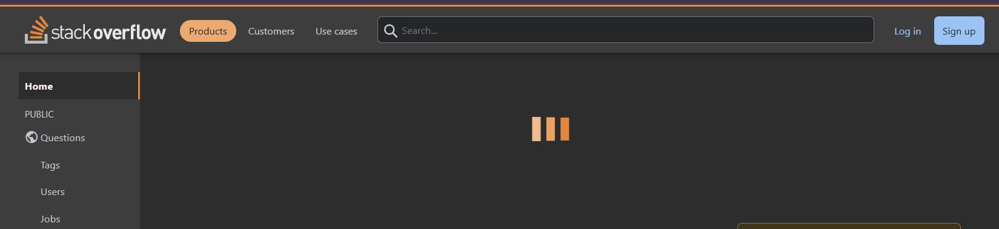

# Stack Overflow Clone

## Overview

A full-stack web application that replicates the core functionalities of the popular Q&A platform, Stack Overflow. This project allows users to post questions, submit answers, upvote/downvote content, and engage in meaningful discussions. Built with a modern tech stack, this project is designed to be responsive, intuitive, and user-friendly.

---

## Features

### 1. User Authentication
- Secure sign-up, login, and logout functionality.
- Password hashing for enhanced security.
- OAuth support (Google authentication).

### 2. Question and Answer Management
- Users can post questions with a title and description.
- Rich text editor for writing detailed answers.
- Upvote and downvote system for both questions and answers.

### 3. Search and Filter
- Search questions by keywords.
- Filter questions by tags or categories.
- Sort questions by popularity or recent activity.

### 4. User Profiles
- Personalized dashboards displaying user activity (questions posted, answers submitted).
- Reputation system based on community interactions.

### 5. Responsive Design
- Fully optimized for desktop, tablet, and mobile views.

### 6. Tags and Categories
- Add tags to questions for better organization and discoverability.
- View all questions under a specific tag.

### 7. Admin Panel
- Admins can manage users, questions, and content.
- Moderation tools for removing inappropriate content.

---

## Tech Stack

### Frontend:
- **React.js**: For building a dynamic and interactive user interface.
- **CSS/SCSS**: For styling and responsive design.

### Backend:
- **Node.js with Express.js**: For handling API requests and server-side logic.

### Database:
- **MongoDB**: For storing user data, questions, answers, and tags.

### Authentication:
- **JWT (JSON Web Tokens)**: For secure user authentication.
- **Passport.js**: For integrating OAuth authentication.

### Deployment:
- **Frontend**: Hosted on [Vercel](https://vercel.com/).
- **Backend**: Deployed on [Render](https://render.com/).
- **Database**: MongoDB Atlas cloud database.

---

## Installation and Setup

### Prerequisites:
- Node.js
- MongoDB (local or cloud)

### Steps:
1. Clone the repository:
   ```bash
   git clone https://github.com/sanketInTech/stack-overflow-clone.git
   ```
2. Navigate to the project directory:
   ```bash
   cd stack-overflow-clone
   ```
3. Install dependencies for the backend and frontend:
   ```bash
   cd backend
   npm install
   cd ../frontend
   npm install
   ```
4. Set up environment variables:
   - Create a `.env` file in the `backend` directory with the following keys:
     ```env
     PORT=5000
     MONGO_URI=your_mongo_connection_string
     JWT_SECRET=your_jwt_secret
     GOOGLE_CLIENT_ID=your_google_client_id
     GOOGLE_CLIENT_SECRET=your_google_client_secret
     ```
5. Start the development servers:
   - Backend:
     ```bash
     cd backend
     npm start
     ```
   - Frontend:
     ```bash
     cd frontend
     npm start
     ```
6. Open your browser and navigate to `http://localhost:3000` to view the app.

---

## Screenshots

### Home Page


### Question Page


### User Profile


---

## Live Demo

Experience the application live: [Stack Overflow Clone Live Demo](#)

---

## Future Enhancements

- **Notifications:** Real-time notifications for user interactions.
- **Dark Mode:** Add a toggle for light and dark themes.
- **Analytics Dashboard:** Track user activity and engagement.
- **Unit Tests:** Implement testing for robust application performance.

---

## Learning Outcomes

This project helped me:
- Deepen my understanding of the MERN stack.
- Learn how to manage state efficiently in React.
- Work with RESTful APIs and database management.
- Implement secure user authentication using JWT and OAuth.
- Deploy a full-stack application to the web.

---

## Contributing

Feel free to contribute to this project by submitting issues or pull requests. To contribute:
1. Fork the repository.
2. Create a new branch.
3. Make your changes and test thoroughly.
4. Submit a pull request with a detailed description of your changes.

---

## Contact

For any questions or suggestions, feel free to reach out:
- **GitHub**: [@sanketInTech](https://github.com/sanketInTech)
- **Email**: sanketdesai1971@gmail.com
- **LinkedIn**: https://www.linkedin.com/in/sanket-desai-

---


